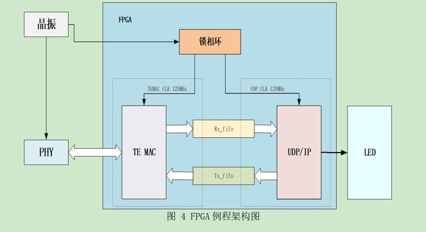

# device-link 项目说明

目标
- 在两块开发板之间建立基于以太网的简单指令链路，通过按键触发向对方发送指令，接收方根据指令控制板上 LED（用于功能验证与互联测试）。

工程结构（与本仓库中相关目录）
- `device_link/tx_instruction_port1/` — 第1块板的 Quartus 工程与源码（包括 `prj/`、`source_code/` 等）。
- `device_link/tx_instruction_port2/` — 第2块板的工程（结构类似）。
- 两个工程都包含 `prj/UDP_IP/` 子工程，内部含 `al_ip/`（PLL、TEMAC 等 IP）、RTL 源及 `UDP_IP.al` 项目文件。

功能概述
- 每块板上有至少一个按键（用于触发发送）和若干 LED（用于显示接受的命令结果）。
- 按键按下时，发送方将生成一个简短的网络指令包通过以太网发送到对方开发板的 UDP 端口。接收方解析指令并改变 LED 状态。
- 该机制可用于两板连通性验证、延迟/丢包测试或演示交互控制。


- 工程文档：

> [!tip]
>
> 我们用以太网基本只干两件事情，一件是发送数据，一件是接受数据。我会分别从发送和接收来讲。先讲接收吧，看例程1，PC发送指令给板子来控制LED，那么板子就是一个接收，我们先观察数据通路，就是下面这张图。



简而言之，接收数据的通路就是PHY->TE MAC->UDP/IP->LED

一个模块一个模块讲。PHY就是我们的网线和网线接口，即我们的物理层。

这个TEMAC的作用是把PHY 的比特流还原成以太网帧，差错控制，等等，可以把他当做数据链路层，但不完全，因为TEMAC只负责数据链路层中的MAC层，而不负责LLC层（MAC子层和LLC子层两者构成了数据链路层，这个计网老师没有讲，我是查AI的，把TEMAC当做数据链路层就行）。

然后按理来说数据链路层往上是网络层，但是由于我们就俩设备连接，也不需要那么复杂的互联，所以这个例程的网络架构好像就没有网络层。

网络层往上就是传输层，传输层有两个协议，一个是UDP一个是TCP/IP协议，我们这边用UDP。

网络层往上就是应用层，我们的LED控制器就是应用层。架构图中的UDP/IP模块（工程中是udp_ip_protocol_stack模组）会把用户数据发给LED。 

我们自己写接收的时候，就是实例化TEMAC和UDP/IP，基本就是按照例程1去做，修改应用层就行。 

发送的过程就是刚刚的数据通路倒过来。直接讲应该怎么做。找到例程1里面有个模组叫udp_loopback。Loopback的意思是回环，例程1运行的时候，你PC给板子什么指令，板子就会给PC发回什么指令，实现发送的模组就是这个udp_loopback。

```verilog
module udp_loopback(
    
input  wire     app_rx_clk     ,

input  wire     app_tx_clk     ,

input  wire     reset        ,

input  wire [7:0]  app_rx_data     ,//例程中这里的输入就是用户数据，我们更改这里的输入就行

input  wire     app_rx_data_valid  ,//这里也一样，改成我们要发送的数据是否有效就行

input  wire [15:0] app_rx_data_length ,//这里需要强调，这里的length是字节数，不是bit数
  
input  wire     udp_tx_ready    ,//这里跟udp模组相连就好，代表udp此时空闲，可以发送

input  wire     app_tx_ack     ,//这里也是跟udp模组相连就好，代表发送的数据成功接受了

output  wire  [7:0] app_tx_data     ,

output  reg     app_tx_data_request,

output  reg     app_tx_data_valid  ,

output  reg  [15:0] udp_data_length       

);

 
```

